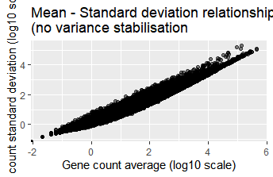
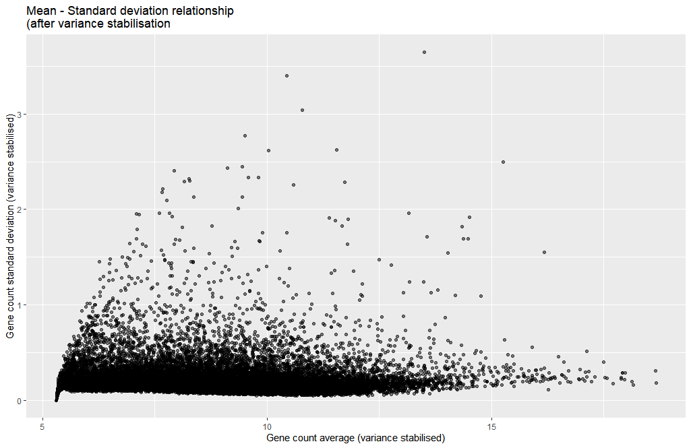
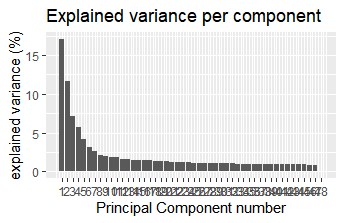
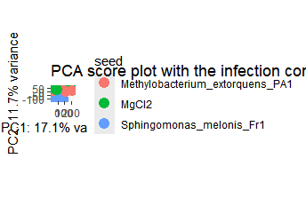

# RNA-Seq Analysis: Treated vs Untreated Arabidopsis Samples

This project aims to perform RNA-seq analysis on Arabidopsis thaliana samples to investigate gene expression differences between treated and untreated conditions. The data used for this project was obtained from [Zenodo record 6325891](https://zenodo.org/record/6325891), containing raw FASTQ files for four Arabidopsis samples.

The dataset includes:

* Arabidopsis\_sample1.fq.gz
* Arabidopsis\_sample2.fq.gz
* Arabidopsis\_sample3.fq.gz
* Arabidopsis\_sample4.fq.gz

The goal of this project is to:

* Perform quality control
* Trim low-quality sequences and adapter contamination
* Align reads to a reference genome
* Quantify expression levels for downstream differential expression analysis

---

## Biological Background

There are different types of RNA in a cell:
**mRNA** => these are messengers which carry the genetic instructions from DNA to ribosomes to make proteins.
**rRNA** => these exist as structural components of ribosomes.
**tRNA** => these carry amino acids.
**Non-coding RNAs** => these include microRNAs, lncRNAs, etc., which regulate gene expression.

Note that in total RNA, **rRNA makes up 80–90%** of the RNA content while **mRNA is only 1–5%**.
So for RNA extraction, we only capture the mRNAs! (**poly-A selection**) We either remove the rRNAs and preserve the mRNA and non-coding RNAs (ribo-minus) or use Poly(A) technique to only capture mRNA.

---

## RNA Alignment Considerations

When it comes to RNA alignment, we must consider that unlike DNA which is continuous, RNA is the spliced version of DNA since introns are omitted during the translation process. Therefore, the DNA sequencing methods don't work well with RNAs because they're not 'splice aware'. Hence, we use methods such as: **STAR, HISAT**, etc which are splice aware and consider regions which belong to introns.

---

## Step-by-Step Guide

### Environment Setup

```bash
conda create -env rna
conda activate rna
```

### Prepare Dataset Directory

```bash
mkdir datasets
```

Place the following files obtained from [Zenodo 6325891](https://zenodo.org/record/6325891) in the directory:

* Arabidopsis\_sample1.fq.gz
* Arabidopsis\_sample2.fq.gz
* Arabidopsis\_sample3.fq.gz
* Arabidopsis\_sample4.fq.gz

---

### Quality Control

```bash
mkdir fastq
for filename in /datasets/*.fq.gz
do
  fastqc -o fastqc $filename
done
```

As a result, multiple `.html` files are produced in the `fastq` directory which can be viewed in the browser.
One of the most important quality factors is **Per base sequence quality**. In the following picture, y-axis shows the quality score where x-axis represents the position in the read.
As we can see, the majority of nucleotides have a high quality (over 28). For instance, the first box plot shows the quality of the first nucleotide base in the sequence. As the sequencing proceeds, we can witness a drop in the quality due to the following common reasons:

* **Signal Decay**
* **Phasing**

As long as the signal decay is only related to the mentioned common issues, we're fine with our sequence and can continue.

---

### Trimming and Filtering

```bash
mkdir trimmed
for infile in datasets/*.fq.gz
do
  outfile="$(basename $infile .fq.gz)"_qc.fq
  trimmomatic SE -phred33 -threads 2 $infile /trimmed/$outfile ILLUMINACLIP:adapters.fasta:2:30:10 LEADING:3 TRAILING:3 SLIDINGWINDOW:4:15 MINLEN:25
done
```

---

### Sequence Alignment with STAR

**How STAR works:**
STAR takes a read and divides it to different parts which are called seeds. Each seed is mapped separately to a part in reference genome which are called **Maximal Mappable Prefixes**. The separate seeds are stitched together to create a complete read.

Other aligners often have to search in the entire genome to find the origin of the seed but STAR uses an indexed array to quickly find the potential site.
We must therefore index our reference genome to be able to use STAR.

```bash
mkdir genomeIndex
gunzip AtChromosome1.fa.gz
STAR --runMode genomeGenerate --genomeDir genomeIndex --genomeFastaFiles AtChromosome1.fa --runThreadN 2
```

Now align:

```bash
mkdir mapped
for infile in trimmed/*.fq
do
  outfile="$(basename $infile .fq)"_
  STAR --genomeDir genomeIndex --runThreadN 2 --readFilesIn trimmed/$infile --outFileNamePrefix mapped/$outfile --outSAMtype BAM SortedByCoordinate --outSAMunmapped None --outFilterMismatchNmax 3 --outFilterMultimapNmax 1 --outSAMattributes All
done
```

---

### View BAM File

```bash
samtools view Arabidopsis_sample1_qc_Aligned.sortedByCoord.out.bam | head
```

### Mapping Statistics

```bash
samtools flagstat Arabidopsis_sample1_qc_Aligned.sortedByCoord.out.bam
```

Sample Output:

```
240312 + 0 in total (QC-passed reads + QC-failed reads)
240312 + 0 primary
...
240312 + 0 mapped (100.00% : N/A)
```

---

### View Specific Reads

```bash
# Unaligned reads
samtools view -f 4 -c Arabidopsis_sample1_qc_Aligned.sortedByCoord.out.bam

# Aligned reads
samtools view -F 4 -c Arabidopsis_sample1_qc_Aligned.sortedByCoord.out.bam

# Forward strand
samtools view -f 20 -c Arabidopsis_sample1_qc_Aligned.sortedByCoord.out.bam

# Reverse strand
samtools view -f 16 -c Arabidopsis_sample1_qc_Aligned.sortedByCoord.out.bam
```

---

## Principal Component Analysis (PCA) and Normalization

In bioinformatics, we often deal with **very large datasets**. PCA (Principal Component Analysis) helps reduce the data into smaller matrices for easier interpretation and visualization while preserving the dataset’s structure.

When visualizing **raw counts**, genes with higher average expression naturally show higher variance. Since PCA assumes that each gene contributes equally in terms of variance, **normalization** is important.
DESeq2 adjusts counts based on **sequencing depth** by calculating **size factors**.

```r
dds <- DESeqDataSetFromMatrix(
  countData = raw_counts, 
  colData = xp_design, 
  design = ~ seed + infected + dpi
)

dds <- estimateSizeFactors(dds)

dds <- estimateDispersions(
  object = dds, 
  fitType = "parametric", 
  quiet = TRUE
)

sizeFactors(dds)

size_factors_df <- tibble(
  sample = names(dds$sizeFactor), 
  correction_factor = dds$sizeFactor
)
```



---
## Performing PCA

Once the mean is independent from the variance, we perform PCA on **normalized data** using `svd()`:

* **U × D (scores):** Coordinates of samples in the new PCA space.
* **V (loadings):** How much each gene contributes to each principal component and in which direction.

**Explained variance** tells us how much variability each PC captures. For example:

```r
cumsum(pca_results$explained_var)[2,1]
```

If this returns `28.8%`, it means **PC1 + PC2 explain 28.8% of the variance** — "If I only look along this axis, I can still understand 28.8% of the data's story."



---

## Visualizing Infection Effects in PCA Space

To assess whether **P. syringae infection** is reflected in PCA results:

1. Merge **PCA scores** with **experimental factors** (`dpi`, infection status, etc.).
2. Plot PC1 vs. PC2 (explaining \~28% variance) and color by experimental condition.

---

## Criteria for a Successful PCA

* Samples from the **same condition** group together.
* **PC1 + PC2** explain a large proportion of total variation.
* Samples from **different conditions** are well separated by PC1 and PC2.



---


